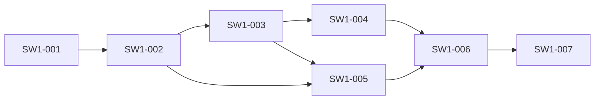
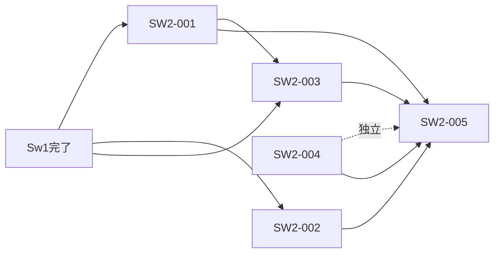
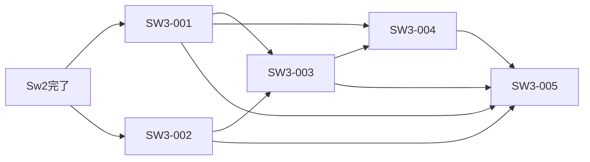
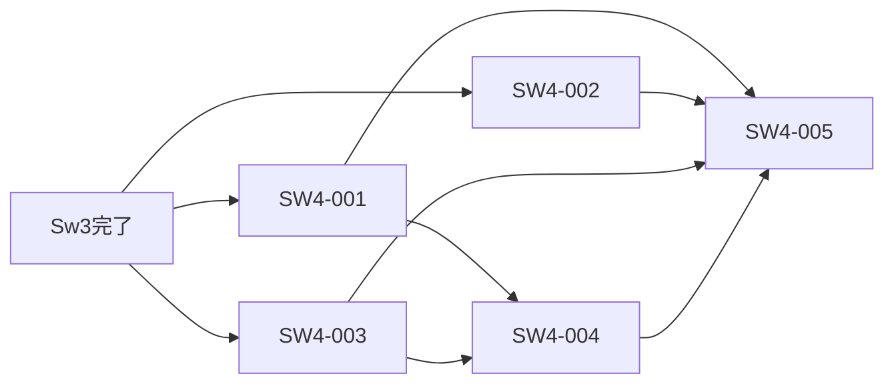

# スウェーデン語G2P チケット一覧

> **マイルストーン計画**: [swedish-g2p-milestones.md](../guides/swedish-g2p-milestones.md)
> **技術調査レポート**: [swedish-g2p-research.md](../guides/swedish-g2p-research.md)

---

## 進捗サマリー

| マイルストーン | チケット数 | 完了 | PER目標 | テスト目標 |
|--------------|----------|------|---------|----------|
| [Sw1](#sw1-コアルールエンジン--基本mvp) | 7 | 7/7 | < 15% | 150+ |
| [Sw2](#sw2-例外辞書--テキスト正規化--x-sampa) | 5 | 5/5 | < 8% | 250+ |
| [Sw3](#sw3-ピッチアクセント--方言--pua--prosody) | 5 | 5/5 | < 4% | 350+ |
| [Sw4](#sw4-multilingual統合--評価ツール--リリース) | 5 | 5/5 | < 4% | 400+ |
| **合計** | **22** | **22/22** | | |

---

## Sw1: コアルールエンジン + 基本MVP

目標: `SwedishG2PEngine.ToIPA("hej")` → `"ˈheːj"` が動作する最小G2Pエンジン

| # | チケット | 状態 | 前提 | 概要 |
|---|---------|------|------|------|
| [SW1-001](SW1-001-project-scaffolding.md) | プロジェクト骨格構築 | TODO | なし | csproj, asmdef, package.json, Internal/, slnx追加 |
| [SW1-002](SW1-002-phoneme-models.md) | 音素・モデル定義 | TODO | SW1-001 | SwedishIpaPhoneme enum(41音素), Phoneme struct, Pronunciation, Syllable, Dialect |
| [SW1-003](SW1-003-orthography-syllabifier.md) | 正書法 + 音節分割 | TODO | SW1-002 | SwedishOrthography, SwedishSyllabifier(Onset最大化) |
| [SW1-004](SW1-004-g2p-rules-engine.md) | G2P規則エンジン(5フェーズ) | TODO | SW1-003 | トリグラフ→子音軟化→母音変換→そり舌化→黙字 |
| [SW1-005](SW1-005-stress-ipa-converter.md) | ストレス + IPA変換 | TODO | SW1-002, SW1-003 | StressAssigner(基本), IpaConverter(41音素マッピング) |
| [SW1-006](SW1-006-engine-main-api.md) | メインエンジンAPI | TODO | SW1-004, SW1-005 | SwedishG2PEngine(パイプライン統合, Public API 8メソッド) |
| [SW1-007](SW1-007-sw1-tests-validation.md) | Sw1テスト + 精度検証 | TODO | SW1-006 | AccuracyTests(25), EdgeCaseTests(5), PER検証 |



---

## Sw2: 例外辞書 + テキスト正規化 + X-SAMPA

目標: 例外辞書300+語でPER < 8%、テキスト正規化で数字・略語を処理可能に

| # | チケット | 状態 | 前提 | 概要 |
|---|---------|------|------|------|
| [SW2-001](SW2-001-exception-dictionary.md) | 例外辞書(TSV + ローダー) | TODO | Sw1完了 | swedish_exceptions.master.tsv(300+語), SwedishExceptionDictionary |
| [SW2-002](SW2-002-normalizer-number-to-words.md) | 正規化 + NumberToWords | TODO | Sw1完了 | SwedishNormalizer(11段階), NumberToWords(en/ett性区別) |
| [SW2-003](SW2-003-xsampa-function-words.md) | X-SAMPA + 機能語 | TODO | Sw1完了, SW2-001 | XSampaConverter(41音素), FunctionWordList |
| [SW2-004](SW2-004-eval-data-sample-tsv.md) | 評価データ取得 | TODO | なし | refresh_swedish_eval_data.ps1, サンプルTSV各256件 |
| [SW2-005](SW2-005-sw2-tests-validation.md) | Sw2テスト + 統合検証 | TODO | SW2-001〜004 | DatasetEvaluation, 正規化テスト, PER < 8%検証 |



---

## Sw3: ピッチアクセント + 方言 + PUA + Prosody

目標: Accent 1/2予測、Central/FinlandSwedish方言対応、PER < 4%

| # | チケット | 状態 | 前提 | 概要 |
|---|---------|------|------|------|
| [SW3-001](SW3-001-pitch-accent-prediction.md) | ピッチアクセント予測 | TODO | Sw2完了 | StressAssigner拡張: 接尾辞規則でAccent 1/2予測 |
| [SW3-002](SW3-002-allophone-processor.md) | 異音処理 | TODO | Sw2完了 | AllophoneProcessor, AllophoneFeatures [Flags] enum |
| [SW3-003](SW3-003-dialect-finland-swedish.md) | 方言対応(FinlandSwedish) | TODO | SW3-001, SW3-002 | そり舌スキップ, A1=0固定, Options拡張 |
| [SW3-004](SW3-004-pua-prosody-api.md) | PUA変換 + Prosody API | TODO | SW3-001, SW3-003 | PuaMapper, ProsodyInfo(A1/A2/A3), ProsodyResult |
| [SW3-005](SW3-005-sw3-tests-dict-expansion.md) | Sw3テスト + 辞書拡充 | TODO | SW3-001〜004 | テスト+100件, 辞書500+語, PER < 4%検証 |



---

## Sw4: Multilingual統合 + 評価ツール + リリース

目標: 8言語対応完成、フル評価でPER目標達成、NuGet/UPMリリース準備

| # | チケット | 状態 | 前提 | 概要 |
|---|---------|------|------|------|
| [SW4-001](SW4-001-multilingual-integration.md) | Multilingual統合 | TODO | Sw3完了 | Language.Swedish=7, Lazy初期化, CapabilityAdapters |
| [SW4-002](SW4-002-text-segmenter-detection.md) | 言語判定ロジック | TODO | Sw3完了 | TextSegmenter: å検出, 信号語, 接尾辞パターン |
| [SW4-003](SW4-003-eval-tool.md) | 評価ツール(SwedishEval) | TODO | Sw3完了 | SwedishEval CLI, フルTSV生成, 閾値JSON |
| [SW4-004](SW4-004-cicd-solution-docs.md) | CI/CD + ドキュメント | TODO | SW4-001, SW4-003 | slnx, ci.yml, sync-shared, CLAUDE.md, CHANGELOG |
| [SW4-005](SW4-005-sw4-full-eval-release.md) | フル評価 + リリース検証 | TODO | SW4-001〜004 | Multilingualテスト35件, フルPER検証, リリースチェック |



---

## クリティカルパス

```
SW1-001 → SW1-002 → SW1-003 → SW1-004 → SW1-006 → SW1-007
                             → SW1-005 → SW1-006 ↗
→ SW2-001 → SW2-003 → SW2-005
→ SW2-002 → SW2-005 ↗
→ SW3-001 → SW3-003 → SW3-004 → SW3-005
→ SW3-002 → SW3-003 ↗
→ SW4-001 → SW4-004 → SW4-005
→ SW4-003 → SW4-004 ↗
```

**並列実行可能なペア**:
- Sw1: SW1-004 と SW1-005 は並列可（両方SW1-003に依存）
- Sw2: SW2-001, SW2-002, SW2-004 は並列可（SW2-003はSW2-001完了後）
- Sw3: SW3-001 と SW3-002 は並列可
- Sw4: SW4-001, SW4-002, SW4-003 は並列可
